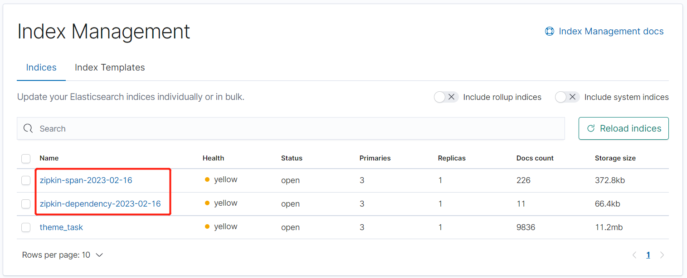

# Zipkin 数据持久化存储
> `zipkin` 默认将数据保存在内存中，这种方式一旦重启将丢失链路数据，不适合生产环境。
> `zipkin` 支持将数据持久化到 `mysql` `elasticsearch` 中

- 整体架构


### 一、`zipkin` 数据持久化 `elasticsearch`
> 前提已部署好 `elasticsearch` 服务
```shell
docker run -d \
    --name zipkin \
    --restart=always \
    -c 128 \
    -m 400M --memory-reservation 100M \
    -p 9411:9411 \
    -v /etc/localtime:/etc/localtime \
    -e STORAGE_TYPE=elasticsearch \
    -e ES_HOSTS=192.168.1.193:9200 \
    -e ES_INDEX=zipkin \
    -e ES_INDEX_REPLICAS=1 \
    -e ES_INDEX_SHARDS=3 \
    openzipkin/zipkin:2.24.0
```


- 自动创建索引
> `span-span-yyyy-mm-dd`



### 二、`zipkin-dependencies` 聚合数据依赖关系
> `zipkin-dependencies` 是一个聚合数据依赖关系的服务。启动后自动从 `elasticsearch` 中获取索引，分析依赖关系
> 然后再以 `zipkin-dependencies-yyyy-mm-dd` 创建新索引存入 `elasticsearch` 。
```text
1. 这个服务内置 crond 定时任务，默认每隔1小时会执行分析 elasticsearch 中索引关系的任务。
```

- 原理分析


- 部署脚本
```shell
docker run -d \
    --name zipkin-dependencies \
    --restart=always \
    -e STORAGE_TYPE=elasticsearch \
    -e ES_HOSTS=192.168.1.193:9200 \
    -e ES_INDEX=zipkin \
    -e ES_INDEX_REPLICAS=1 \
    -e ES_INDEX_SHARDS=3 \
    openzipkin/zipkin-dependencies:2.4.0
```
- 日志
> 定时任务执行日志
```shell
[root@localhost zipkin]# sh build-zipkin-dependencies.sh 
zipkin-dependencies
zipkin-dependencies
f1dc1f50782cd6ae7d845cf45c9dd74a5d4d52ab8c09ae3c2daab47796a1ae84
23/02/16 07:34:16 INFO ElasticsearchDependenciesJob: Processing spans from zipkin:span-2023-02-16/span
23/02/16 07:34:16 WARN NativeCodeLoader: Unable to load native-hadoop library for your platform... using builtin-java classes where applicable
23/02/16 07:34:17 WARN Java7Support: Unable to load JDK7 types (annotations, java.nio.file.Path): no Java7 support added
23/02/16 07:34:17 WARN Resource: Detected type name in resource [zipkin:span-2023-02-16/span]. Type names are deprecated and will be removed in a later release.
23/02/16 07:34:17 WARN Resource: Detected type name in resource [zipkin:span-2023-02-16/span]. Type names are deprecated and will be removed in a later release.
23/02/16 07:34:17 WARN Resource: Detected type name in resource [zipkin:span-2023-02-16/span]. Type names are deprecated and will be removed in a later release.
23/02/16 07:34:18 INFO ElasticsearchDependenciesJob: No dependency links could be processed from spans in index zipkin:span-2023-02-16/span
23/02/16 07:34:18 INFO ElasticsearchDependenciesJob: Processing spans from zipkin-span-2023-02-16
23/02/16 07:34:19 INFO ElasticsearchDependenciesJob: Saving dependency links to zipkin-dependency-2023-02-16
23/02/16 07:34:19 INFO ElasticsearchDependenciesJob: Done
```